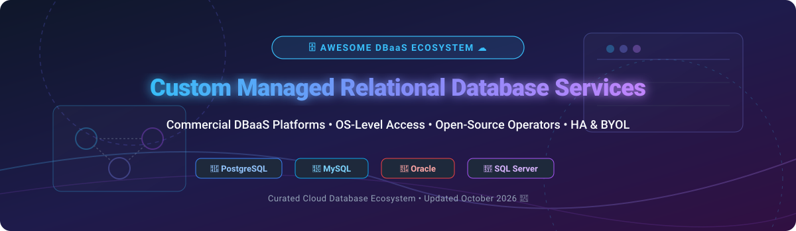

# Awesome-Custom-Managed-Relational-Database-Service 🗄️ ☁️

  

  
  
  
  
  
  

---

## 🌟 Top Custom Managed Relational Database Service Ecosystem 🚀

**Curated Directory of Managed Relational Database Services (DBaaS), Commercial Database Automation Platforms & Open-Source Database Operators**  

*Focused on Custom OS-Level Access, Bring-Your-Own-License (BYOL), Kubernetes Operators, Automated Backups, Point-in-Time Recovery (PITR), High Availability (HA) & Self-Hosted Database Infrastructure.*

**Last updated: October 2026** 📅

---

### 📌 Sector Overview & Market Context 📈

> [!IMPORTANT]
> **Market Size & Structure:** The global Managed Relational Database Services (DBaaS) market size is estimated at **$68.5 Billion in 2026** and projected to reach **$140+ Billion by 2030**, growing at a CAGR of ~19.5%. The market is **moderately concentrated among hyperscalers** (AWS, Azure, GCP, Oracle) for standard managed offerings, but **highly fragmented** in specialized custom managed DBaaS, OS-level customization, and open-source Kubernetes database operators.

**Key Market Context:**
- **Amazon RDS Custom** is the **only hyperscaler managed service providing OS-level access** (via AWS Systems Manager / SSH), enabling custom agent installation and legacy ERP integration ☁️.
- **Azure SQL Managed Instance** delivers **100% SQL Server engine compatibility** with native VNet integration for seamless enterprise migrations 🔷.
- **Tessell** leads independent DBaaS platforms with **single-tenant BYOC (Bring Your Own Cloud) deployments** across AWS and Azure 🎯.
- **CloudNativePG & Vitess** represent the pinnacle of **open-source cloud-native database infrastructure**, powering high-availability PostgreSQL and enterprise MySQL sharding 🐘 🐬.

---

## 📑 Table of Contents 🧭

- [🏢 SaaS & Commercial Platforms](#-saas--commercial-platforms)
- [🔓 Open-Source GitHub Projects](#-open-source-github-projects)
- [🛠️ How to Contribute](#%EF%B8%8F-how-to-contribute)
- [📊 Star History](#-star-history)
- [🤝 Support & Sponsorship](#-support--sponsorship)
- [⚠️ Disclaimer](#%EF%B8%8F-disclaimer)

---

## 🏢 SaaS / Commercial Platforms 🌐

*Sorted by Company Valuation / Market Cap (Descending)* 💰

| SaaS / Commercial Platform | Company / Owner | Valuation / Market Cap 🏢 | Standard Edition Pricing 💵 | Free Tier / Free Trial Limits 🎁 | Description 📝 |
| :--- | :--- | :--- | :--- | :--- | :--- |
| **[Azure SQL Managed Instance](https://azure.microsoft.com/en-us/products/azure-sql/managed-instance/)** 🔷 | Microsoft | **~$3.90 Trillion** | **$0.34/hour** ($248/month, 4 vCore General Purpose) | **Free tier: 750 hours of GP Gen5 for 12 months** | **Azure-native fully managed SQL Server** — Full SQL Server compatibility, native VNet integration, cross-database queries, and SQL Agent. 🔷 |
| **[Amazon RDS Custom](https://aws.amazon.com/rds/custom/)** ☁️ | Amazon | **~$2.00 Trillion** | **$0.18/hour** ($131/month, db.m5.large instance) | **Free tier: 750 hours of db.m5.large for 12 months** | **AWS custom managed DBaaS** — The only hyperscaler service providing OS-level root/admin access for custom legacy applications. ☁️ |
| **[Google Cloud Bare Metal Database](https://cloud.google.com/bare-metal/docs)** 🌐 | Google (Alphabet) | **~$2.00 Trillion** | **$0.68/hour** ($490/month, 8 vCPU Bare Metal core) | **Free trial: $300 free credits valid for 90 days** | **GCP bare metal database infrastructure** — Managed bare metal for workloads requiring OS control with zero virtualization overhead. 🌐 |
| **[Oracle Cloud Database Service](https://www.oracle.com/cloud/database/)** 🔴 | Oracle | **~$300 Billion** | **$0.27/hour** ($195/month, VM.Standard.E4.Flex OCPU) | **Always Free: 2 Autonomous Databases (20 GB each)** | **Oracle Cloud managed DB** — Autonomous Database with self-driving automation, Exadata cloud infrastructure, and OS root access on Base DB. 🔴 |
| **[Nutanix Era Cloud](https://www.nutanix.com/products/era)** 🔮 | Nutanix | **~$15 Billion** | **$120/core/year** ($10/core/month license) | **Free trial: 30-day hosted trial with full features** | **Multi-cloud database automation** — One-click database provisioning, cloning, patching, and lifecycle management across hybrid clouds. 🔮 |
| **[Rackspace Managed Databases](https://www.rackspace.com/)** 🏢 | Rackspace Technology | **~$500 Million** | **$150/month** (Starter Managed DB Instance) | **Free trial: 14-day trial with 24/7 DBA support** | **Hands-on managed database services** — Managed DBA support, architecture design, and 24/7 proactive monitoring across MySQL and Postgres. 🏢 |
| **[Tessell](https://www.tessell.com/)** 🎯 | Tessell | **~$250 Million** | **$0.15/hour** ($108/month, BYOL instance) | **Free trial: 30-day trial with $500 usage credits** | **High-performance multi-cloud DBaaS** — Single-tenant BYOC deployment, automated point-in-time recovery, and multi-engine governance. 🎯 |
| **[EnterpriseDB Postgres](https://www.enterprisedb.com/)** 🐘 | EnterpriseDB | **~$200 Million** | **$180/vCore/year** ($15/vCore/month Cloud Service) | **Free trial: 60-day trial for EDB Postgres Advanced** | **Enterprise PostgreSQL DBaaS** — EDB Postgres Advanced Server featuring native Oracle database compatibility, security, and high availability. 🐘 |
| **[ScaleGrid Enterprise](https://scalegrid.io/)** 📊 | ScaleGrid | **~$50 Million** | **$100/month** (BYOL Standalone instance) | **Free trial: 30-day free trial (no credit card)** | **Multi-cloud DBaaS management** — Fully managed PostgreSQL, MySQL, Redis, and MongoDB on AWS, Azure, GCP, and DigitalOcean. 📊 |
| **[Percona Cloud Managed Services](https://www.percona.com/)** 🔧 | Percona | **~$40 Million** | **$250/node/month** (Managed Open-Source DB) | **Free trial: 30-day trial of Percona Platform & PMM** | **Expert open-source managed database** — Enterprise-grade 24/7 managed operations for MySQL, PostgreSQL, and MongoDB. 🔧 |

---

## 🔓 Open-Source GitHub Projects 🐙

*Sorted by GitHub_Stars_Count (Descending)* 🌟

- **[Vitess](https://github.com/vitessio/vitess)**   
  **Database clustering system for horizontal scaling of MySQL**, Apache-2.0 licensed. **CNCF Graduated project** powering YouTube, Slack, and Square. Features distributed sharding, connection pooling, and Vitess Kubernetes Operator. 🌐

- **[Patroni](https://github.com/zalando/patroni)**   
  **Template for PostgreSQL High Availability**, MIT licensed. The industry-standard PostgreSQL HA solution using etcd, Consul, or Kubernetes for automatic failover and leader election. 🏛️

- **[pgAdmin 4](https://github.com/pgadmin-org/pgadmin4)**   
  **Leading Open-Source PostgreSQL Management Tool**, PostgreSQL licensed. Web and desktop administration console featuring query analysis, schema design, and server monitoring. 🖥️

- **[CloudNativePG](https://github.com/cloudnative-pg/cloudnative-pg)**   
  **Fastest-growing Kubernetes Operator for PostgreSQL**, Apache-2.0 licensed. 100% open-source with declarative backups, point-in-time recovery (PITR), primary/standby architecture, and rolling updates. 🐘

- **[PgBackRest](https://github.com/pgbackrest/pgbackrest)**   
  **Reliable PostgreSQL Backup & Restore**, MIT licensed. High-performance parallel backup tool supporting delta restore, block-level incremental backups, S3, GCS, and Azure Blob Storage. 💾

- **[Bytebase](https://github.com/bytebase/bytebase)**   
  **Database DevOps and Schema Migration Tool**, Apache-2.0 licensed. Web-based database CI/CD workflow for developers and DBAs supporting PostgreSQL, MySQL, Oracle, and SQL Server. 🛠️

- **[StackGres](https://github.com/ongres/stackgres)**   
  **Full-stack Enterprise PostgreSQL on Kubernetes**, AGPL-3.0 licensed. All-in-one distribution packaging Patroni HA, PgBouncer pooling, Prometheus metrics, and Grafana dashboards out of the box. 🥞

- **[Percona Operator for MySQL](https://github.com/percona/percona-xtradb-cluster-operator)**   
  **Production-grade MySQL Operator on Kubernetes**, Apache-2.0 licensed. Automates Percona XtraDB Cluster (PXC) deployment with synchronous replication, ProxySQL load balancing, and automated backup. 🐬

- **[Percona Operator for MongoDB](https://github.com/percona/percona-server-mongodb-operator)**   
  **Production-grade MongoDB Operator**, Apache-2.0 licensed. Manages Percona Server for MongoDB replica sets and sharded clusters with automated scaling, consistent backup, and PMM integration. 🍃

- **[KubeDB Operator](https://github.com/kubedb/operator)**   
  **Kubernetes-native Multi-Database Operator**, Apache-2.0 licensed. Universal database manager providing automated provisioning, schema management, backup, and clustering for PostgreSQL, MySQL, Redis, and MongoDB. ☸️

- **[Postgres Operator by Zalando](https://github.com/zalando/postgres-operator)**   
  **Battle-tested PostgreSQL Kubernetes Operator**, MIT licensed. Manages highly available PostgreSQL clusters powered by Patroni, Spilo, and logical backup automation. ⚡

- **[MySQL Shell](https://github.com/mysql/mysql-shell)**   
  **Advanced MySQL Client & Scripting Shell**, GPL-2.0 licensed. Official administration tool supporting Python/JavaScript scripting, AdminAPI for InnoDB Cluster management, and X DevAPI. 🐬

---

## 🛠️ How to Contribute 🤝

Contributions are welcome! Follow these steps to submit new custom managed database platforms or open-source database operations software:

1. 🍴 **Fork** the repository.
2. 📝 **Add/edit** entries in `README.md` maintaining table/list structure and formatting.
3. 🔗 Include project title, official website/GitHub link, exact Stars_Count badge, license, and brief description.
4. 🚀 Submit a **Pull Request** with a descriptive summary of your changes.

---

## 📊 Star History

---

## 🤝 Support & Sponsorship 💖

If you find this curated list of custom managed relational database services and open-source database operators helpful, please consider supporting the project:

- ⭐ **Star** this repository to increase visibility!
- 🔀 **Fork** and share with database administrators, DevOps engineers, and cloud architects.
- ☕ **Buy Me a Coffee**: Support ongoing maintenance and open-source curation via the [GitHub Sponsor Dashboard](https://github.com/sponsors/ishandutta2007).

---

## ⚠️ Disclaimer ℹ️

- This is a **community-curated directory** for informational and educational purposes. ℹ️
- **Amazon RDS Custom is currently the primary managed service providing OS-level root/admin access** — indispensable for enterprise legacy software requiring custom kernel or database extensions.
- **Open-Source Kubernetes Database Operators** (CloudNativePG, StackGres, Vitess) require active Kubernetes cluster management, persistent storage provisioning, and disaster recovery validation.
- Always perform comprehensive proof-of-concept testing for backup, failover, and point-in-time recovery before deploying to production environments. 🗄️

---

  <b>Made with ❤️ for database engineers, platform teams, and open-source database advocates.</b>

